 Laporan Praktikum Basis Data - Pertemuan 1

Nama: Nia Ramadhani  
NIM: 25430049  
Kelas: B  
Pertemuan: 01
Tanggal: 4 Oktober 2026  
Nama Dosen: Dedi Irawan, S.Kom., M.T.I.

 1. Tujuan Praktikum

 - Supaya saya lebih paham tentang database. Disini saya tidak hanya belajar teori tapi saya juga mencoba langsung meenggunakan MariaDB melalui XAMPP.

 2. Ringkasan Dasar Teori
 - Database bukan hanya tempat menyimpan data, tetapi perlu untuk dikelola lebih baik lagi. Mulai dari cara menjalankan server, mengatur pengguna, menggunakan hak akses, sampai menyimpan hasil kerja menggunakan Git dan Github.
 - Disini database yang saya gunakan yaitu MariaDB, apa si MariaDB? yaitu sistem yang digunakan untuk mengelola dsatabase. Untuk menjalankan MariaDB, kita menggunakan XAMPP yang dimana XAMPP membantu kita untuk menjalankan server database agar lebih mudah. Di dalam XAMPP sendiri terdapat XAMPP Control Panel yang bisa kita gunakan untuk menjalankan dan menghentikan MariaDB.
 - Di dalam MariaDB terdapat beberapa akun pengguna, salah satunya adalah akun root. Dimana akun root itu memiliki hak akses yang sangat besar sehingga penggunaannya harus lebih hati-hati. Untuk kegiatan sehari-hari, kita juga bisa membuat akun lain dengan hak akses yang sesuai kebutuhan. supaya tidak semua pengguna bisa mengubah ataupun menghapus data sembarangan.
 - saya juga belajar menggunakan Git dan GitHub. Git digunakan untuk mencatat perubahan pada file atau pekerjaan yang kita buat, sedangkan GitHub digunakan untuk menyimpan pekerjaan tersebut secara online.
 - CLI atau Command Line Interface adalah cara untuk menjalankan perintah melalui command prompt. Pada praktikum ini, CLI digunakan untuk masuk ke MariaDB dan menjalankan perintah secara langsung.phpMyAdmin adalah aplikasi berbasis web yang digunakan untuk mengelola database dengan tampilan yang lebih mudah dipahami. 
 Kalau menggunakan CLI kita harus mengetik perintah sendiri, sedangkan di phpMyAdmin tersedia berbagai menu yang bisa digunakan untuk mengelola database. Misalnya membuat database, melihat database, membuat tabel, dan mengatur pengguna.
 Jadi, phpMyAdmin bisa membantu kita yang masih belajar database karena tampilannya lebih mudah digunakan.

 3. Hasil Langkah Percobaan

 D.1 Menjalankan Layanan MariaDB

 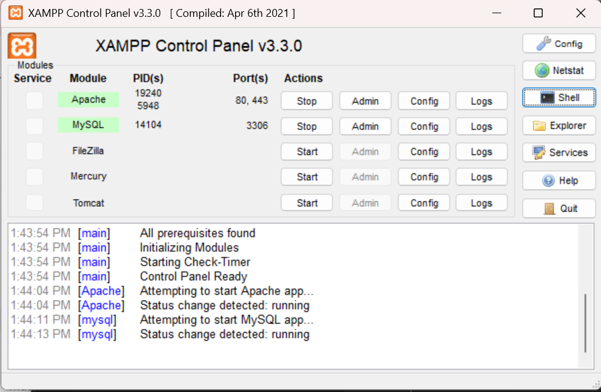
 Keterangan : disini saya menjalankan masriaDB melalui Xampp control panel, ketika sudah dijalankan maka mariaDB siap di gunakan.

 D.2 Masuk Melalui Klien Baris Perintah
 
 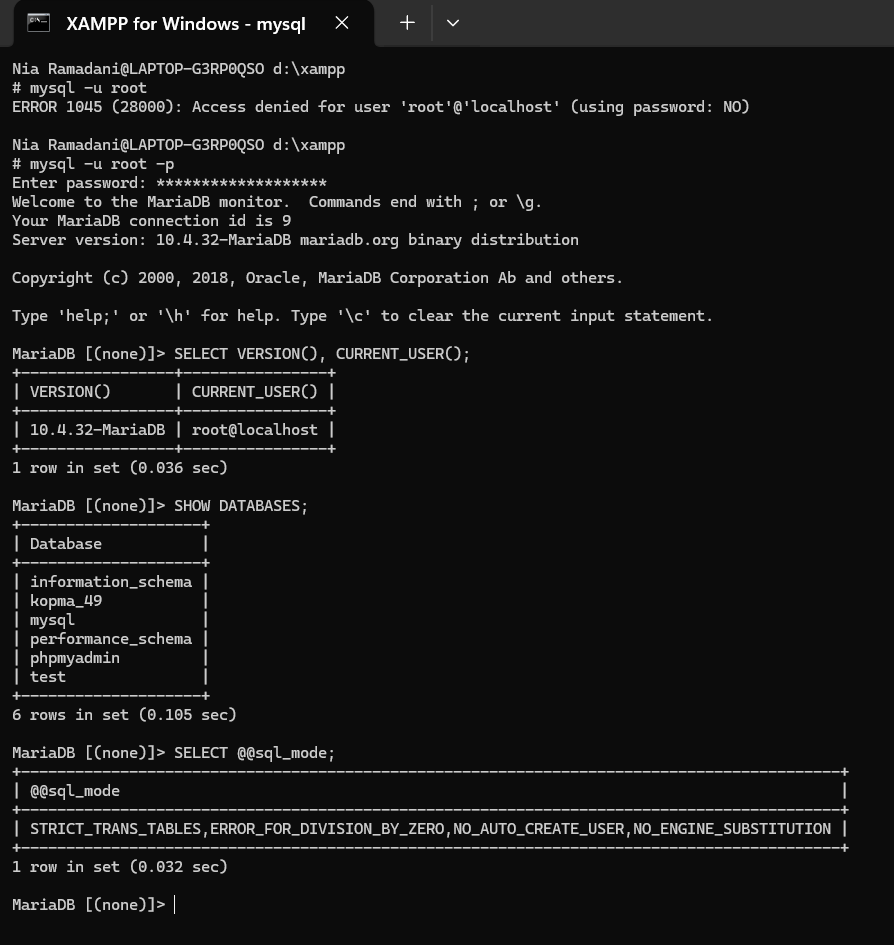
 Keterangan : Masuk ke mariaDB lewat Command Prompt setelah itu masukan perintah yang di perlukan.

 D.3 Mengamankan akun root

 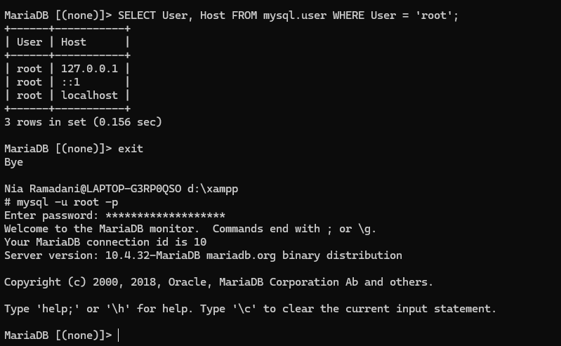
 Keterangan : disini saya menggunakan akun root dengan menggunakan password, setetlah itu saya masuk lagi menggunakan password tersebut.

 D.4  Membuat Basis Data dan Akun Kerja 

 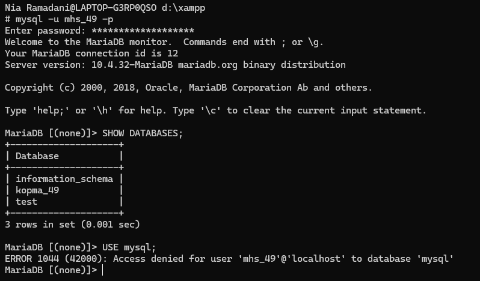
 keterangan : ini saya membuat database kopma_49 dan akun kerja mhs_49. Akun tersebut menggunakan hak akses untuk mengelola database kopma_49.

 D.5  Menggunakan phpMyAdmin dengan Aman

 
 keterangan : disini saya mengubah konfigurasi phpmyadmin confiq menjadi cookie.
 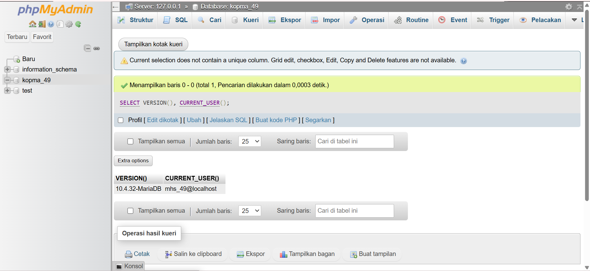
 Keterangan : setelah ubah konfik, saya membuka browser dan mencoba akun yang sudah saya buat dengan password.

 D.6  Menyiapkan Repositori Git

 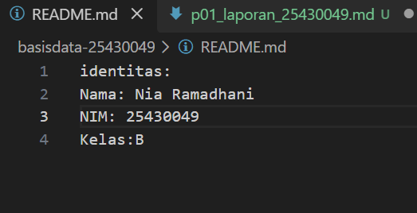
 Keterangan : pada tahap ini saya membuat file README yang berisi identitas dan informasi yang sedang di kerjakan.
 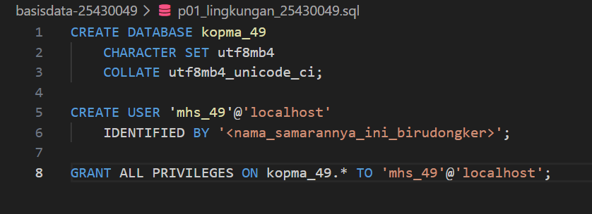
 keterangan : Saya membuat file SQL yang berisi perintah-perintah yang digunakan selama praktikum.
 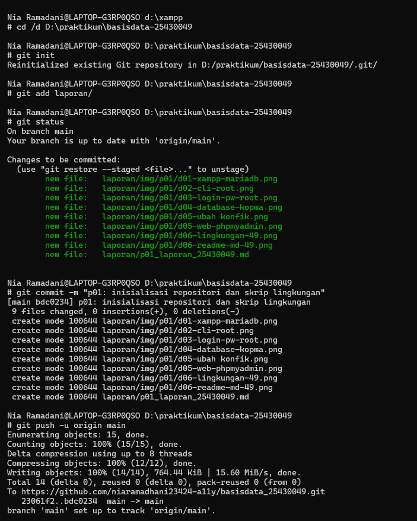
 keterangan : saya menyiapkan repositori git untuk menyimpan hasil pekerjaan praktikum.
 
 4. Jawaban Titik Analisis

 Titik Analisis 1
 
 disisni mysql yang digunakan yaitu mariaDB jadi mencari solusi error di internet saya harus memperhatikan apakah solusi tersebut sesuai dengan MariaDB.
 Jadi, kalau saya mencari solusi saat mengalami error, saya harus memastikan solusi tersebut bisa digunakan di MariaDB. Kalau tidak cocok, saya bisa melihat dokumentasi MariaDB supaya tidak salah mengikuti langkahnya.

Titik Analisis 2

 setelah akun root dibuat dan menggunakan password, saya tidak bisa masuk dengn mysql -u root tetapi harus menggunakan mysql -u root -p
 kemudian saya diminta masukan password, jadi dimana eror yang muncul sebelumnya terjadi karena saya mencoba login tanpa memberikan password.

Titik Analisis 3

 masih bisa terlihat karena database tersebut merupakan bagian dari sistem MariaDB. Sedangkan database mysql tidak bisa saya buka menggunakan akun kerja karena akun tersebut tidak mempunyai hak akses ke database tersebut.
 Dari sini saya jadi paham bahwa setiap akun bisa memiliki hak akses yang berbeda. Jadi, tidak semua akun bisa membuka atau mengubah semua database.

Titik Analisis 4

 menggunakan mode cookie lebih aman karena username dan password tidak disimpan langsung di file konfigurasi phpMyAdmin. Jadi, ketika ingin masuk ke phpMyAdmin, saya harus login terlebih dahulu.

 5. Hasil Latihan dan Modifikasi

 E.1

 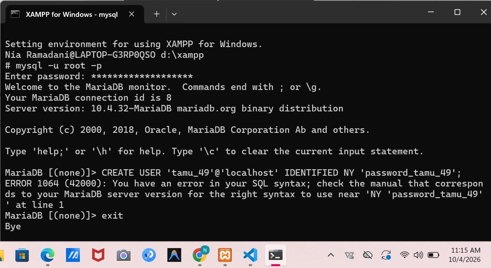
 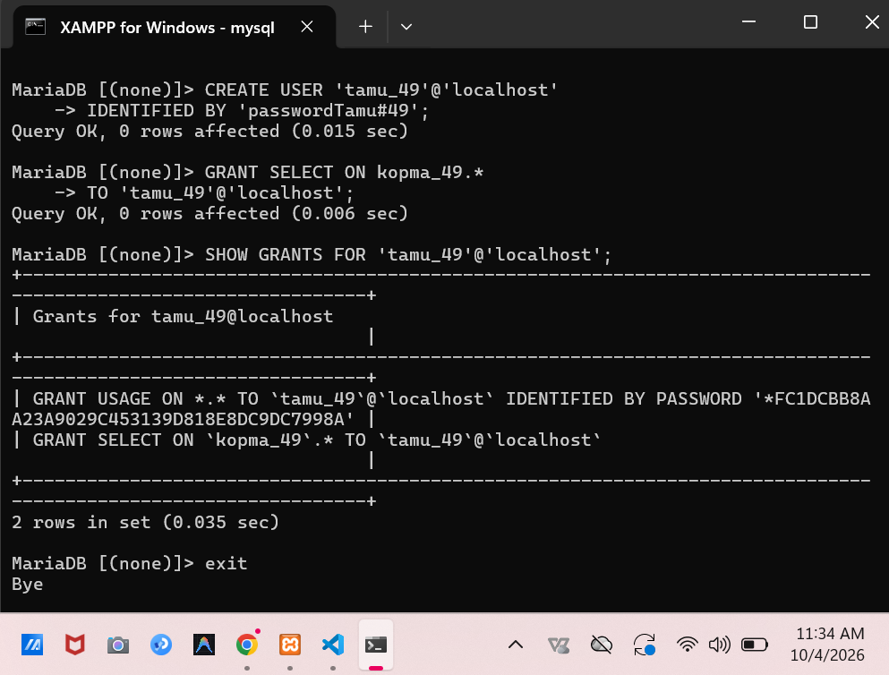
 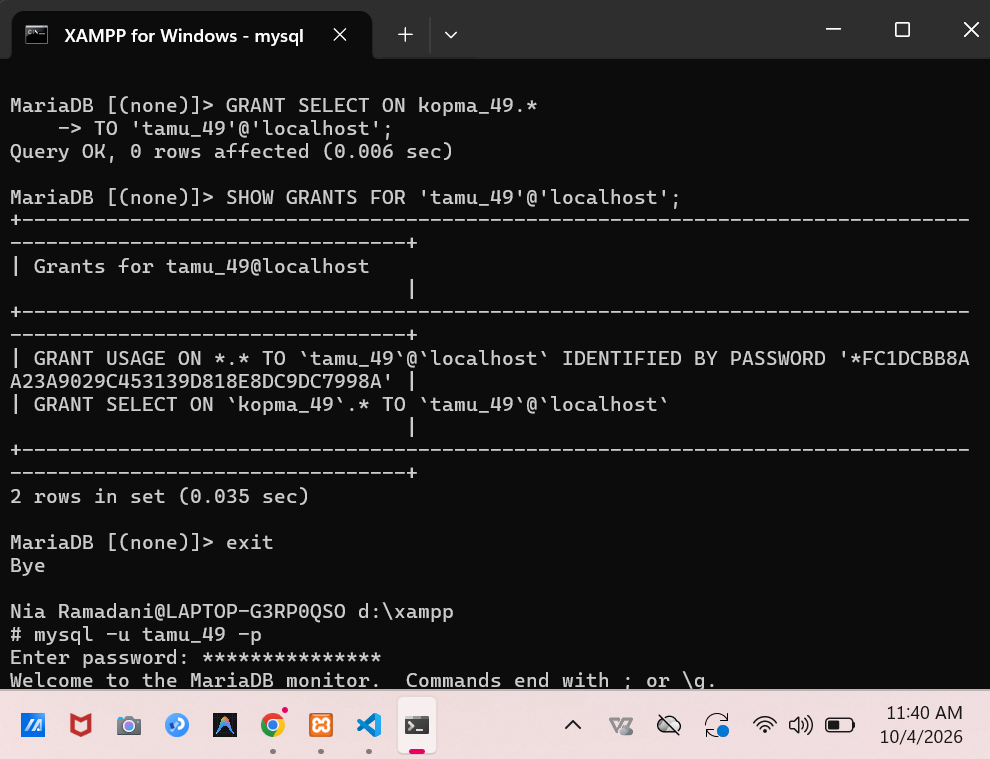
 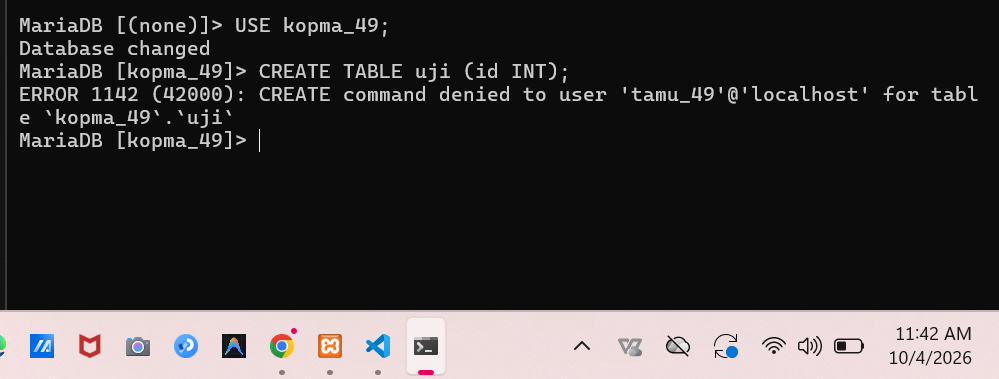
 ERROR 1142. Artinya, user tersebut tidak mempunyai izin untuk menjalankan perintah

 E.2

 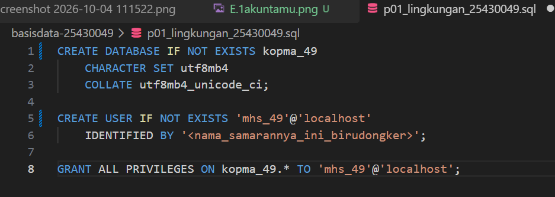
 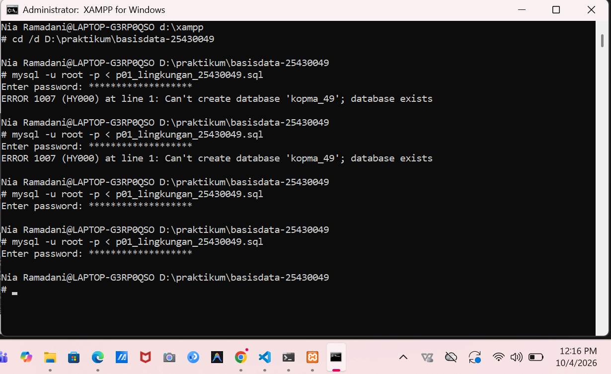

 6. Tugas Mandiri: Milestone Proyek 1
 
 disini saya menggunakan tema Klinik dengan nama klinik_49
 Database ini nantinya akan digunakan untuk menyimpan data yang berhubungan dengan kegiatan klinik.
 dan saya membuat akun dev_49 yang dimana akun tersebut digunakan untuk mengelola database klinik_49 

 Identitas Proyek
 Tema: Klinik
 Nama Organisasi: Klinik Nia Sehat

 Klinik Nia Sehat adalah klinik yang menyediakan layanan pemeriksaan kesehatan untuk pasien. Klinik ini melayani pendaftaran pasien, pemeriksaan oleh dokter, pencatatan hasil diagnosis, tindakan medis, pemberian resep dan obat, serta pembayaran. Database nantinya digunakan untuk menyimpan data pasien, dokter, kunjungan, tindakan, obat, resep, dan pembayaran.
 Saya membuat lingkup layanan tersebut sebagai gambaran awal untuk menentukan data apa saja yang nantinya akan dibutuhkan dalam proyek.
 aya juga membuat file .gitignore untuk mencegah file yang berisi password atau informasi rahasia ikut masuk ke GitHub.

Isi file tersebut:
 *.env
 kredensial*.txt

 7. Pembahasan dan Kendala
 
 Selama praktikum, awalnya saya masih sedikit bingung dengan penggunaan MariaDB, terutama karena di XAMPP tertulis MySQL.
 saya juga bingung saat menggunakan akun root setelah diberi password. Setelah mencoba beberapa kali, saya akhirnya paham bahwa untuk login menggunakan password saya harus menambahkan -p.
 saya juga jadi lebih paham tentang hak akses. Ternyata kalau sebuah akun hanya diberi hak SELECT, akun tersebut hanya bisa melihat data dan tidak bisa membuat tabel.
 saya mulai belajar menggunakan Git dan GitHub untuk menyimpan hasil praktikum. Menurut saya, penggunaan Git cukup membantu karena hasil pekerjaan bisa disimpan dan perubahan yang dilakukan bisa dicatat.
 

 8. Kesimpulan

 Dari praktikum ini saya menjadi lebih paham tentang dasar penggunaan MariaDB. Saya belajar menjalankan database melalui XAMPP, menggunakan CLI dan phpMyAdmin, membuat user, memberikan hak akses, serta mengamankan database.

 Saya juga berhasil membuat Milestone Proyek 1 dengan tema Klinik. Database proyek yang saya buat adalah klinik_49 dan akun yang digunakan adalah dev_49.

 Menurut saya, praktikum ini cukup membantu karena saya bisa langsung mencoba perintah database dan melihat hasilnya, bukan hanya mempelajari teorinya.

 9. Pernyataan Penggunaan AI

 Dalam pembuatan laporan ini saya menggunakan bantuan AI untuk membantu menyusun dan merapikan kalimat agar lebih mudah dipahami. Proses praktikum, menjalankan perintah, membuat database, dan mengambil screenshot dilakukan berdasarkan pekerjaan saya sendiri.

 10. Bukti Git

 Repository: https://github.com/niaramadhani23424-a11y/basisdata_25430049

 !Commit: [bukticommit](img/p01/10-buktigitcommit.png)

 Checklist

- [ ] D.1–D.6 selesai
- [ ] Titik Analisis 1–4 dijawab
- [ ] E.1–E.2 selesai
- [ ] Milestone Proyek 1 selesai
- [ ] Bukti screenshot lengkap
- [ ] Git commit dan push